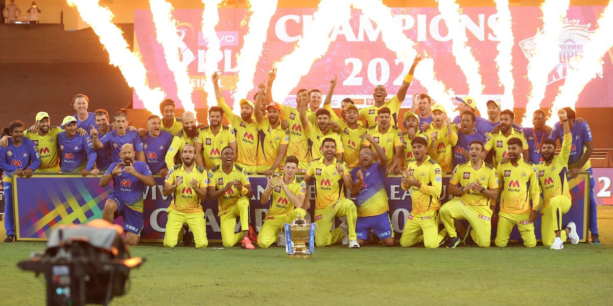

# `IPL2021 analysis using API data`

### **`the winner is CSK`**

**`APIs used are explained in` [API docs](/APIdocs.md)**
## `to-dos:`
- [x] get data using APIs
- [x] store data in json and csv files
- [x] using csv files overall and teamwise analysis of
    - [x] batting
    - [x] bowling
    - [x] fielding
- [x] word analysis
    - [x] word clouds for 
        - [x] names and 
        - [x] commentary match wise and overall season